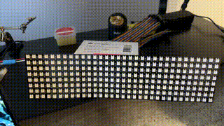
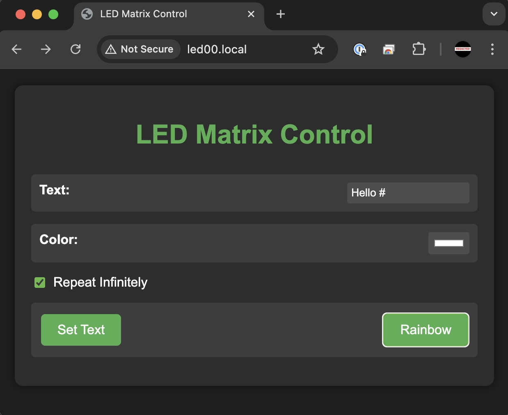
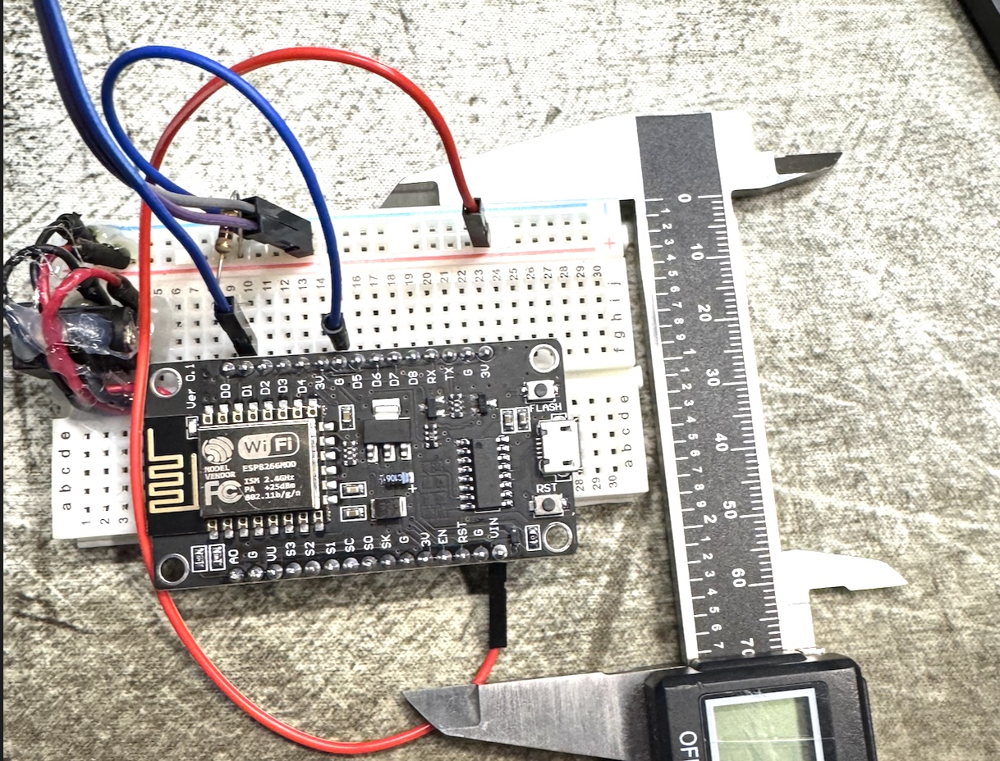
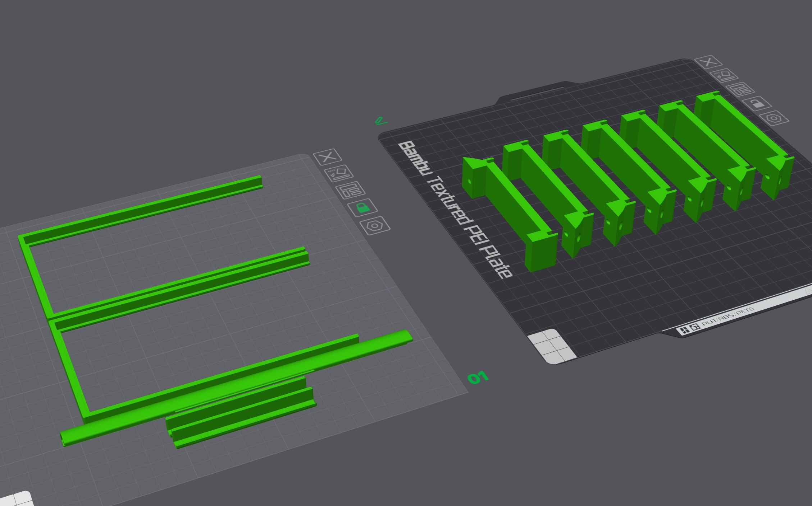
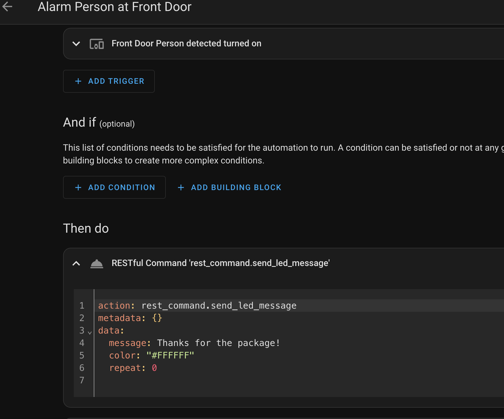
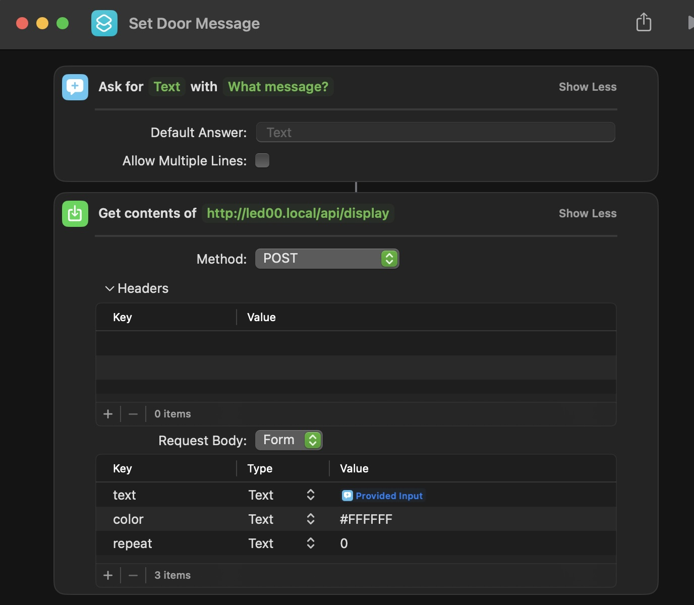

# LED Matrix Display Controller

This project is a web-controlled LED matrix display using an ESP8266 microcontroller. It allows users to set scrolling text, choose colors (including a rainbow mode), and control repetition through a web interface or REST API.

I'm using this to display messages on my front door for deliveries and such.

The project uses C and PlatformIO to build the firmware.

<p align="center">

</p>

## Features

- Scrolling text display on an 8x32 LED matrix
- Web interface for easy control
  
- REST API for programmatic control
- Color selection (including rainbow mode)
- Option to repeat text infinitely
- Persistent settings (survives reboots)
- mDNS support for easy discovery on local networks

## Hardware Requirements

> **Note:** The ESP8266 does not have enough power to drive the LED matrix directly. You can use a 5V 4A power supply to power the ESP8266 and the LED matrix. Make sure to connect the grounds together and use a 470Ω resistor between the ESP8266 and the LED matrix D2 pin.

- ESP8266 microcontroller
- 8x32 LED matrix display
- Power supply
- 470Ω resistor



## 3D Printed Case
This was printed on a Bambu P1S using PLA. You need plate supports for the trim piece.  I tried to arrange in the best way on this 3mf file.

[LED Case 3MF](LEDCase.3mf)



## Software Overview

The software runs on the ESP8266 and provides the following:

1. LED matrix control for scrolling text display
2. Web server for hosting the control interface

3. REST API for programmatic control
4. WiFi connection management
5. mDNS for local network discovery

## Web Interface

The web interface allows users to:

- Enter text to display
- Choose a color (or select rainbow mode)
- Set infinite repeat option
- Apply settings to the LED matrix

## Home Assistant Integration

> **Note:** The Home Assistant integration uses the REST API and needs local DNS configuration since the docker container doesn't work properly with mDNS.

Add this to your `configuration.yaml` in Home Assistant. You can then use the `send_led_message` service in automations.
```
rest_command:
  send_led_message:
    url: "http://led00/api/display"
    method: post
    payload: "text={{ message }}&color={{ color }}&repeat={{ repeat }}"
    content_type: "application/x-www-form-urlencoded"
```

Example Automation:


## Apple HomeKit Integration

mDNS works in homekit so you can use the hostname `led00.local` to control the display.

Example Automation:




## REST API

The REST API provides the following endpoints:

### GET /api/display

Retrieves the current display settings.

Example:


Note: Replace `led00.local` with the IP address of your device if mDNS is not working on your network.

```
curl http://led00.local/api/display
```


### POST /api/display

Creates new display settings. Requires all parameters.

Example:

```
curl -X POST -d "text=Hello%20World&color=%23FF0000&repeat=1" http://led00.local/api/display
```


### PUT /api/display

Updates existing display settings. Allows partial updates.

Example:

```
curl -X PUT -d "color=%2300FF00" http://led00.local/api/display
```


### DELETE /api/display

Clears the display.

Example:

```
curl -X DELETE http://led00.local/api/display
```

## Setup and Installation

1. Clone this repository
2. Open the project in Arduino IDE
3. Install the required libraries:
   - ESP8266WiFi
   - ESPAsyncWebServer
   - Adafruit_GFX
   - Adafruit_NeoMatrix
   - Adafruit_NeoPixel
4. Set your WiFi credentials in the code
5. Upload the code to your ESP8266
6. Connect the LED matrix to the appropriate pins on the ESP8266
7. Power on the device and connect to your WiFi network

Once set up, you can access the web interface by navigating to `http://led00.local` in your web browser (or use the IP address if mDNS is not working).

## Contributing

Contributions to this project are welcome. Please fork the repository and submit a pull request with your changes.

## License

This project is licensed under the GNPU GPLv3 License - see the LICENSE file for details.